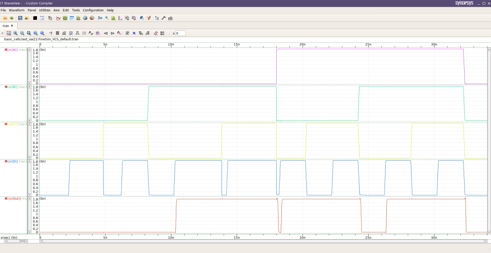

# Tarea 2 del curso de Introducción al diseño de circuitos integrados

## Estudiantes
- Jesús Rojas Vargas
- Brayan Montenegro Elizondo

## Referencias
[1] N. Weste and D. Harris, CMOS VLSI Design: A Circuits and Systems Perspective, 4 edition. Boston: Addison-Wesley, 2010.

[2] Process and Device Specification XH018 - 0.18 μm  Modular Mixed Signal HV CMOS, PDS-01813. Release 7.0.1. XFAB Semiconductor Foundries, Nov. 2017.

[3] R. L. Boylestad, Electronic Devices and Circuit Theory, Pearson Educación, 2002.

## Desarrollo

### Parte 1. Cálculos de esfuerzo lógico, potencia promedio, tiempos de retardo $t_{pdr}$, $t_{pdf}$ y de contaminación $t_{cdr}$, $t_{cdf}$

Este apartado se debe resolver el problema 9.4 de [1] que dice: "Design a static CMOS circuit to compute $F = (A + B)(C + D)$ with least delay. Each input can present a maximum of 30 $\lambda$ of transistor width. The output must drive a load equivalent to 500 $\lambda$ of transistor width. Choose transistor sizes to achieve least 
delay and estimate this delay in $\tau$." Para esto se plantean **dos** posibles soluciones, una con compuerta compleja OAI22 y otra con compuertas simples (NANDs, NORs e inversores). Para cada solución se realiza el análisis de esfuerzo lógico y la determinacion del tiempo de retardo mediante la aproximación de Elmore.

#### Primera solución: Compuerta compleja (OAI22+Inv)

Se comienza determinando el retardo mediante el analisis de esfuerzo lógico. Como la carga a llevar es de 500 $\lambda$ y cada entrada presenta un máximo de 30 $\lambda$ entonces el esfuerzo eléctrico del camino es de: $H=\frac{500}{30}=16.7$, además el esfuerzo de ramificación es de $B=1$ y el número de etapas $N=2$. Se sabe tambien que el esfuerzo logico de camino es $G=2\cdot1$. Con esto se puede determinar el esfuerzo de camino $F=GBH=2\cdot1\cdot16.7=33.3$. Por último, se determina el retardo $D$ como:

$D=2\cdot F^{\frac{1}{2}} + P$, donde $P=4+1=5$.

$D=2\cdot 33.3^{\frac{1}{2}} + 5 = 16.5\tau$. 

En este caso $\tau$ corresponde a $3RC$ que se definió en la primera tarea como aproximadamente $20ps$

Con esto $D=330 ps$.

Para determinar el tamaño del inversor de salida se utiliza la ecuacion:

$C_{in} = \frac{C_{out}\cdot g_i}{\hat{f}}$

$C_{in} = \frac{500 \lambda \cdot 1}{5.77}$

$C_{in} = 87 \lambda$

Con esto se definieron los tamaños para los anchos de los transistores, manteniendo la relación P/N = 2:

PMOS se define como $20 \lambda = 20 \cdot 90 nm = 3.6 \mu m$

NMOS se define como $10 \lambda = 10 \cdot 90 nm = 1.8 \mu m$

##### Método de Elmore para estimación del retardo
Para realizar este cálculo, se consideró el esquemático de la Figura que se muestra a continuación:

Donde se detallan las resistencias, capacitancias y ramas a tomar en cuenta al establecer el modelo RC. Primeramente se calculó los tiempos de contaminación, iniciando con el $t_{cdr}$:

$t_{cdr} = \left(\frac{R}{2} + \frac{R}{2}\right)(12C + 3C) + 4C\left(\frac{R}{2}\right) + 4C\left(\frac{R}{2}\right) + RC\left(3 + 450\mu\right)$

$t_{cdr} = 15RC + 2RC + 2RC + 19.98 ps$

Donde $19,98 ps$, corresponde al aporte de tiempo que agrega el inversor conectado a la capacitancia parásita en la conexión con la salida de la compuerta compleja.

$t_{cdr} = 146.52 ps$

Seguidamente, se calculó el tiempo $t_{cdf}$:

$t_{cdf} = \left(\frac{R}{2} + \frac{R}{2}\right)(12C + 3C) +  \left(\frac{R}{2}\right)(12C + 3C) $

$t_{cdf} = 15RC + \frac{15}{2}RC + 19.98 ps$

$t_{cdf} = 169.73 ps $

Luego se calcularon los tiempos de propagación, primeramente el $t_{pdr} $:

$t_{pdr} = \left(\frac{R}{2} + \frac{R}{2}\right)(12C + 3C) + 19.98 ps$

$t_{pdr} = \frac{15}{2}RC + \frac{15}{2} RC+ 19.98 ps$

$t_{pdr} = 119.88 ps$

Finalmente se calculó el tiempo $t_{pdf}$

$t_{pdf} = \left(\frac{R}{2} + \frac{R}{4}\right)(12C + 3C) + 19.98 ps$

$t_{pdf} =  \frac{45}{4}RC + \frac{15}{2} RC+ 19.98 ps$

$t_{pdf} = 144.86 ps$

#### Segunda solución: Compuertas simples

La soluciòn por medio de compuertas simples emplea el uso de 3 compuertas NOR, implicando que el esfuerzo de ramificación es de $B=1$ y el número de etapas $N=2$, el esfuerzo lógico de camino para este tipo de compuertas corresponde a $5/3$.

$P = 2\cdot 2 = 4$

$G = \frac{5}{3} \cdot \frac{5}{3} = \frac{25}{9}$

Con lo que se tienen los datos necesarios para el esfuerzo de camino:

$F = GBH = \frac{25}{9} \cdot 1 \cdot \frac{50}{3} = \frac{1250}{27}$

$D=2\cdot F^{\frac{1}{2}} \cdot  4 = 18.6 \tau$

Y finalmente se multiplica por la constante $\tau$:

$D = 18.6 \cdot 20 ps$

$D = 372 ps$

##### Método de Elmore para estimación del retardo
Para el cálculo de los tiempos de retardo por el método de Elmore para esta compuerta, se tomó en cuenta el esquemático mostrado a continuación:

En base a este modelo, se calculó cada uno de los tiempos de contaminación y propagación, primeramente el $t_{cdr}$:
$t_{cdr} = \left(\frac{R}{2} + \frac{R}{2}\right)(6C + 3C) + 4C\left(\frac{R}{2}\right)3C + \frac{R}{2}(3C + 2C + 450\mu C)$

$t_{cdr} = 9RC + 2RC + 3RC + (\frac{5}{2}+ 450\mu)RC$

$t_{cdr} = 109.89 ps$

Seguidamente, se calculó el tiempo $t_{pdf}$:

$t_{cdf} = \frac{R}{2}(6C + 3C) + \frac{R}{2}(3C + 450\mu C)$

$t_{cdf} =39.96 ps$

Luego los tiempos de propagación $t_{pdr}$ y $t_{pdf}$:

$t_{pdr} = \frac{R}{2}(6C + 3C) + \frac{RC}{2}(9 + 450\mu C)$

$t_{pdr} = 59.94 ps$

$t_{pdf} = \frac{R}{4}(6C + 3C) + \frac{R}{4}(3C + 450\mu C)$

$t_{pdf} = 19.98 ps$

### Parte 2. Verificación de la funcionalidad lógica y eléctrica de los circuitos mediante simulación

#### Delay para la solución con compuertas simples

En la siguiente figura se muestra la simulación para la verificación lógica y eléctrica de la funcion logica realizada con compuertas NOR. En este se observan las cuatro entradas y en color rojo la salida donde se verifica que cumple con la funcion logica.

A continuacion se midió el delay correspondiente en la salida tomando como referencia a la entrada D que conmuta más.

Como se observa en la figura anterior el valor de $t_{pdr}$ medido es de 112 ps y el valor de $t_{pdf}$ es de $174 ps$.

#### Delay para la solución con una compuerta compleja

En la siguiente figura se muestra la simulación para la verificación lógica y eléctrica de la función lógica realizada con la compuerta compleja Or-and-inverter.

A continuacion se midió el delay correspondiente en la salida tomando como referencia a la entrada D que conmuta más.

Como se observa en la figura anterior el valor de $t_{pdr}$ medido es de $117 ps$ y el valor de $t_{pdf}$ es de $175 ps$.

La teoría de esfuerzo lógico por sí sola no es suficiente para realizar una aproximación precisa del retardo de propagación y contaminación en un circuito CMOS. Esto se debe a que la teoría de esfuerzo lógico es una aproximación simplificada que no considera todos los factores que influyen en el rendimiento del circuito.

En particular, la teoría de esfuerzo lógico no tiene en cuenta los efectos de las cargas capacitivas parásitas presentes en el circuito real. Estas capacitancias parásitas, que surgen de las interconexiones y las capacitancias de difusión y polisilicio, pueden tener un impacto significativo en los tiempos de retardo, especialmente en el caso de cargas pesadas o caminos de señal largos.

Además, la teoría de esfuerzo lógico asume que las formas de onda de entrada son ideales, con transiciones abruptas entre los niveles lógicos, enn la práctica, las formas de onda de entrada pueden tener tiempos de transición finitos, lo que puede afectar los tiempos de retardo del circuito.

Entonces, aunque la teoría de esfuerzo lógico puede ofrecer una estimación inicial del rendimiento del circuito, para obtener una evaluación precisa de los tiempos de retardo y contaminación, la simulación es el enfoque más efectivo. Posteriormente, la teoría de Elmore surge como una herramienta complementaria, ya que considera los peores escenarios a los que pueden estar expuestos los circuitos.

### Parte 3. Implementación de los *Layouts* de los circuitos

En base a a la afirmación planteada sobre el cálculo de potencia incorrecto, es importante comprender que la aproximación utilizada previamente para el cálculo del consumo de potencia tiene una limitación significativa. Esta aproximación supone que todas las señales de entrada conmutan a la máxima frecuencia posible, lo cual no es un escenario realista en la mayoría de los casos.

En un circuito digital real, las señales de entrada suelen tener una distribución de probabilidad de conmutación específica, determinada por la naturaleza de la aplicación y los patrones de datos que se procesan. Para obtener una estimación más precisa del consumo de potencia, es necesario considerar esta distribución de probabilidad y calcular el factor de conmutación adecuado para cada señal de entrada.

La premisa planteada, propone un enfoque más preciso para el cálculo del consumo de potencia, ya que en lugar de suponer que todas las señales conmutan a la máxima frecuencia, se asume que cada señal de entrada conmuta con una distribución uniforme con media 1/N, donde N es el número de entradas de la compuerta.

Este enfoque reconoce que, en promedio, cada señal de entrada tiene una probabilidad igual de 1/N de conmutar en un ciclo de reloj determinado. Al utilizar esta distribución uniforme, se obtiene un factor de conmutación más realista para cada señal de entrada, lo que a su vez conduce a una estimación más precisa del consumo de potencia del circuito.

Es importante destacar que este enfoque sigue siendo una aproximación, ya que en la práctica, las distribuciones de probabilidad de conmutación pueden ser más complejas y depender de los patrones de datos específicos manejados por el circuito. Sin embargo, al considerar la distribución uniforme con media 1/N, se logra una estimación más cercana a la realidad que la suposición de conmutación máxima para todas las entradas.
